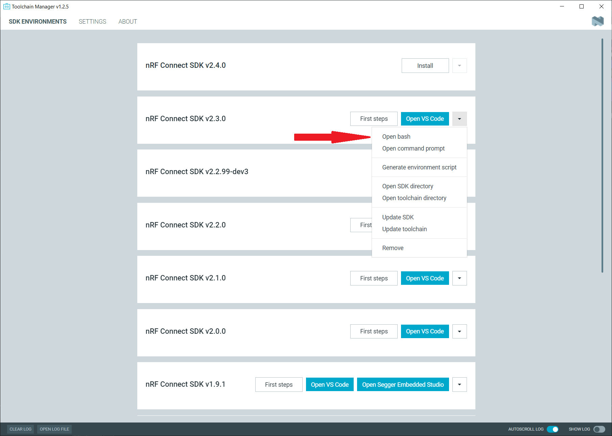
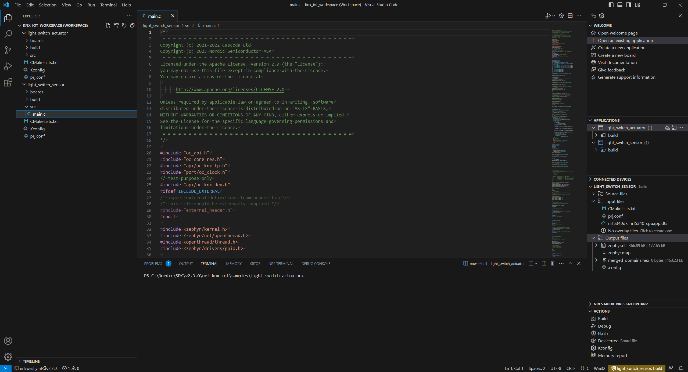
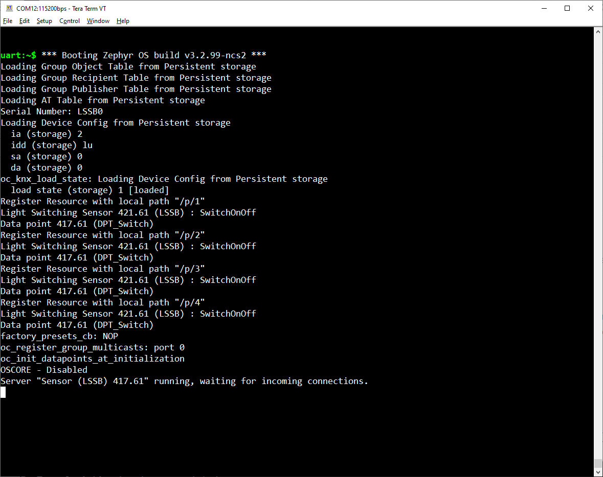

# Chapter 1 - Setup of the KNX IoT Software and Firmware Build
With the nRF Connect SDK v2.3.0 being installed, we need to download the KNX IoT software. <br>
As this is still an experimental project and part of the Nordic Playground it has not been forked to the official nRF Connect SDK.

### Step 1: Clone the KNX IoT Point API repository

You may clone the KNX IoT software into your NCS v2.3.0 installation directory, for example:

```
cd C:\Nordic\SDK\v2.3.0
```
Technically, the project can be cloned into any directory. When compiling the firmware we will initialize the shell/build environment with the Zephyr toolchain which closes the dependency links.
```
git clone https://github.com/NordicPlayground/nrf-knx-iot.git
```

> **Note**
> If you don't use git on the command prompt, and the PATH variable isn't configured, run the Toolchain Manager and hit **Open bash** from the downarrow menu next to your installed nRF Connect SDK v2.3.0. 


### Step 2: Download further dependencies
```
cd nrf-knx-iot/
```
Further dependencies (mbedtls, tinycbor, gtest) need to be downloaded as git submodules into the newly cloned repository.
```
git submodule init
git submodule update
```

### Step 3: Build the KNX IoT Samples

The KNX IoT samples use relative paths and have a dependency to the cloned repository, thus we compile the project samples from within the directory (in my case C:\Nordic\SDK\v2.3.0\nrf-knx-iot\samples) instead of your workspace directory of choice. This in turn means, we will use the samples as existing applications within VS code. <br>

> **Note**
> You may also compile the project on the command line, but we will follow the GUI approach through VS Code here.

Run VS Code and open the nRF Connect extension. <br>

#### A) KNX IoT Light Switch Sensor
Hit "Open an existing application", and navigate through the explorer window to ``SDK/v2.3.0/nrf-knx-iot/samples``. Select the light switch sensor.<br>
As with other Zephyr projects, you will need to add a build configuration to the project. If unsure about this process, please take a look at my [Matter workshop](https://github.com/kkotinkar/Matter-Workshop/blob/main/1_Matter_End_Device.md#step-3-add-a-build-configuration) that describes this step more detailed. Select the ``nrf5340dk_nrf5340_cpuapp`` as board, and keep the remaining settings on default, create the build configuration and build the project. <br>

#### B) KNX IoT Light Switch Actuator
Repeat the process for the second sample project, the light switch actuator. Here, select the ``thingy53_nrf5340_cpuapp`` as board. 

> **Note**
> As indicated earlier, you may use different boards, and only need to ensure you select the correct board for the build configuration.



### Step 4: Flash the boards

#### A) KNX IoT Light Switch Sensor / nRF5340-DK
Flashing the nRF5340-DK is fairly straightforward due to the onboard J-Link debugger. You can flash the nRF5340 via VS Code and the **Flash** button under Actions of the nRF Connect Extension.

> **Note**
> When having issues during firmware flashing and/or verification, please perform a clean reset of the board and try again. If the issue persists, please check on installed J-Link driver and installed version of nRF command line tools. Update both if outdated.

#### B) KNX IoT Light Switch Actuator / Thingy:53

The Thingy:53 can be flashed from the nRF5340-DK if you have a compatible JTAG/SWD 10pin cable at hand.<br>
Use the ``Debug out`` pin header, found next to the power supply and current measurement pin headers, and connect it with the Thingy:53.<br>

> **Note**
> You can execute the flash process via VS Code as done on the nRF5340-DK, or use the nRF Programmer app. The hex file that contains both images (for the nRF5340 app + net core) is called ``merged_domains.hex``, after build it is found under: ``\nrf-knx-iot\samples\light_switch_actuator\build\zephyr\merged_domains.hex``.


Alternatively, flash the Thingy:53 via the bootloader (MCUBoot). Therefore, switch off the Thingy:53, open the case and keep button SW2 pressed while switching on the Thingy:53 to boot into MCUBoot.


You may then use the nRF Programmer app, and select the ``dfu_application.zip`` as file to flash/write (the *.zip file is MCUBoot compatible and contains images for both cores, app and network core). <br>
It is found under ``\nrf-knx-iot\samples\light_switch_actuator\build\zephyr\dfu_application.zip``. Further instructions on how to flash the Thingy:53 are explained [here](https://developer.nordicsemi.com/nRF_Connect_SDK/doc/latest/nrf/device_guides/working_with_nrf/nrf53/thingy53_gs.html#updating-through-usb).


### Step 5: Verify the programmed firmware

Reset the board(s) and verify the terminal output. <br>

Log output from the Light Switch Sensor (nRF5340-DK):
<br>


> **Note**
> Due to the USB enumeration on the Thingy:53, you will likely not see the shell output during boot. Seeing response on the UART shell when hitting "Enter" shall be sufficient for Thingy:53.

## Next Chapter

### [Chapter 2 - Test and Use the KNX IoT System](./2_KNX_Control.md)