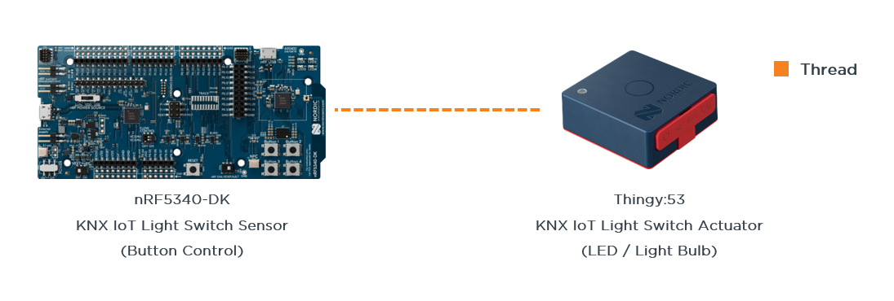

# KNX IoT Workshop
This workshop guides you through the setup of a KNX IoT over Thread network, using Nordic SoCs.
This guide follows the official Nordic documentation, found under the [Nordic Playground](https://nordicplayground.github.io/nrf-knx-iot/index.html).

We will run two Nordic samples, a KNX IoT Sensor and a KNX IoT Actuator that are communicating directly over Thread. There is no further Thread device/gateway needed. 

1. The KNX Sensor is simply a control interface/switch, we will use a nRF5340 DK with its buttons to trigger actions. 
2. The KNX Actuator will react based on these actions. We will use a Thingy:53 to trigger its LEDs based on the pressed buttons. Note the Thingy:53 has 3 LEDs, which compose its RGB LED, seen in the top left corner.

 

You will need: 

1. **nRF5340-DK**
2. **Thingy:53**

> **Note**
> You may also use any different combination of the nRF52840-DK, the nRF5340-DK and the Thingy:53 to test the KNX IoT samples. It is a matter of selecting the right build configuration. The Thingy:53 has a UI limitation of 1x button + 3x LEDs.

The KNX IoT software and official KNX IoT Point API stack were ported to the nRF Connect SDK v2.3.0. Note that other NCS releases have not been tested/used with it. In this regard, it's recommended to **stick to nRF Connect SDK v2.3.0**.  
If you haven't yet set up the nRF Connect SDK & development environment, please follow along.

## Prologue - Setting up the Development Environment
> **Note**
> A recommended setup video can be found online under: [nRF Connect for VS Code - Installation](https://www.youtube.com/watch?v=zcMCaODyISo)

We will follow the guided, and automated installation through nRF Connect for Desktop and will use the recommended IDE: Microsoft's VS Code.

**Step 1**: Download and install the following tools:
1. [nRF Command Line Tools](https://www.nordicsemi.com/Products/Development-tools/nrf-command-line-tools/download)
   - This should also install the required J-Link drivers for programming + debugging any Nordic Development Kits (DKs). Do so, if you don't have any previous J-Link drivers installed. If you cancel/abort this step, please install the latest J-Link driver manually (these can be found [here](https://www.segger.com/downloads/jlink/)).
2. [nRF Connect for Desktop](https://www.nordicsemi.com/Products/Development-tools/nRF-Connect-for-Desktop/Download)
   - The main desktop application acts as an umbrella for several tools, including the Toolchain Manager to install the SDK or the nRF Programmer to use for flashing an image to a Nordic device.
3. [Visual Studio Code](https://code.visualstudio.com/Download)
   - VS Code will be our preferred IDE. It will be extended with Nordic's plugins/extensions to enable a fully featured coding and debugging environment for Nordic + Zephyr RTOS projects.
  
**Step 2**: After installation of all three applications, please open nRF Connect for Desktop. **Install the Toolchain Manager** that is used for downloading and installing the nRF Connect SDK.

**Step 3**: Run the Toolchain Manager, **install the nRF Connect SDK v2.3.0** (as this version will be used in the workshop).
> **Newer SDK version available** You may use a newer SDK version, but keep in mind to then refer to the latest documentation and hyperlinks!

> **Warning**
> Ensure to use a basic directory name (no special characters!) and keep the installation directory close to the file system root!   This will ensure no further issues with scripts and the toolchain on heavily nested projects. I am using ***C:/Nordic/SDK***

**Step 4**: Open VS Code through the Toolchain Manager to detect missing extensions/plugins. **Install Nordic's VS Code extensions** (nRF Connect, nRF Terminal, nRF Konfig etc.) by clicking on install missing extensions. Note that you can also install those through the VS Code extensions tab when searching the extensions marketplace for nRF Connect for VS Code extension pack. Also note that you should be aware of conflicting extensions if you have used VS Code previously with other extensions.

**Step 5**: Run VS Code and **perform the Quick Setup on the nRF Connect extension**. Select the nRF Connect SDK and toolchain that matches your setup (here v2.3.0).

# Workshop - Table of Contents
### [Chapter 1 - Setup of the KNX IoT Software and Firmware Build](./1_SetupSW_BuildFirmware.md)
### [Chapter 2 - Test and Use the KNX IoT System](./2_KNX_Control.md)